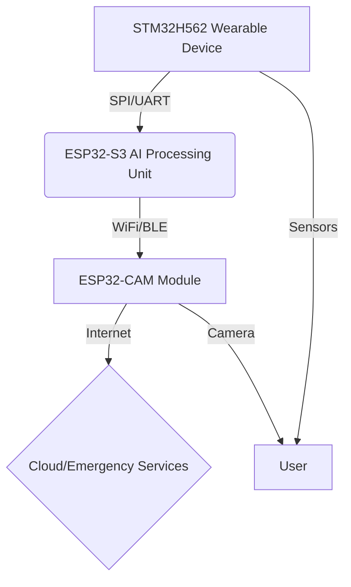

# Guardian Angel: Wearable Health & Emergency Response System

## 🧠 **Project Overview**

**Guardian Angel** is a comprehensive health monitoring and emergency response system designed to be used by the wearer to alert emergency contacts in case of emergency. The project includes:

- **Medical Devices**
- **AI/ML**
- **Robotics**
- **IoT Communication**

This project emphasises:
- Multi-MCU coordination  
- Real-time processing  
- Robust wireless communication

## 🧩 **System Architecture**



## 🎯 **Target Disciplines**

- **Medical:** Real-time vital sign monitoring, emergency response protocols  
- **AI/ML:** Fall detection, anomaly detection, optional voice recognition  
- **Embedded Systems:** Multi-MCU, RTOS, signal processing, low-power  
- **IoT:** Wireless protocols, internet connectivity, remote access  

## 🔧 **Phase 1: STM32H562 Wearable Device**  
**Priority:** HIGH

### 1.1 Hardware Components

- **MCU:** STM32H562 (Cortex-M33, 250MHz, with NPU)
- **Sensors:**
  - MAX30100/30102 (Heart rate & SpO₂)
  - BMI160 (Accelerometer/Gyro)
  - DS18B20 (Temperature)
  - INMP441 (Microphone - optional)
- **UI:** Buzzer, LEDs, optional display  
- **Power:** Battery management system  
- **Comms:** SPI/UART to ESP32-S3  

### 1.2 Software Architecture (RTOS-based)

#### Core Tasks

- `Sensor Sampling` (50Hz)
- `Signal Processing` (DSP filtering)
- `Data Transmission` (to ESP32-S3)
- `Power Management`
- `Voice Processing` *(Optional)*

#### Key Components

- **DSP Pipeline**
  - Heart rate via peak detection
  - SpO₂ via red/IR signal processing
  - Filtering & noise reduction
- **Data Fusion & Packaging**
  - Timestamping, aggregation, serialisation
- **Optional On-device AI**
  - Fall detection (accel/gyro)
  - Wake word detection using NPU

### 1.3 Development Milestones

#### **Week 1: Foundation (Days 1–4)**
- [ ] STM32H562 environment setup  
- [ ] Sensor integration (MAX30100, BMI160, DS18B20)  
- [ ] RTOS task creation  
- [ ] SPI/UART link to ESP32-S3  

#### **Week 2: Core Features (Days 5–8)**
- [ ] HR and SpO₂ monitoring  
- [ ] Accelerometer/Gyro data processing  
- [ ] Sensor fusion & communication  
- [ ] Power management

#### **Optional Extension (Days 9–10)**
- [ ] Voice recognition  
- [ ] NPU for AI (fall/voice detection)  

## 🤖 **Phase 2: ESP32-S3 AI Processing Unit**  
**Priority:** HIGH

### 2.1 Hardware Components

- **MCU:** ESP32-S3 (Dual-core 240MHz with vector extensions)  
- **Comms:** SPI/UART from STM32, WiFi/BLE to ESP32-CAM  
- **Power:** Shared or independent battery

### 2.2 Core Functions

- Data reception from STM32  
- ML-based fall detection *(if offloaded)*  
- Anomaly detection (vital signs)  
- Emergency state machine logic  
- Wireless communication to ESP32-CAM

### 2.3 Software Tasks

```
├── Data Reception Task
├── ML Processing Task (optional)
├── Anomaly Detection Task
├── Emergency State Machine Task
└── Communication Task (WiFi/BLE)
```

### 2.4 Development Milestones

#### **Week 1 (Days 3–5)**
- [ ] ESP32-S3 dev environment  
- [ ] Comms protocol setup  
- [ ] Basic data parsing  

#### **Week 2 (Days 6–10)**
- [ ] Fall detection algorithm  
- [ ] Vital sign anomaly detection  
- [ ] Emergency logic  
- [ ] Comms to ESP32-CAM  

## 📸 **Phase 3: ESP32-CAM Module**  
**Priority:** MEDIUM

### 3.1 Hardware Components

- **MCU:** ESP32-CAM (OV2640 camera)  
- **Comms:** WiFi, BLE from ESP32-S3  
- **Power:** Adapter or battery backup  

### 3.2 Core Functions

- Alert reception from ESP32-S3  
- Image capture and streaming  
- Web dashboard (alerts & health status)  
- Optional data logging  

### 3.3 Development Milestones

#### **Week 2 (Days 8–12)**
- [ ] WiFi setup  
- [ ] ESP32-S3 link  
- [ ] Camera capture  
- [ ] Web server alerts  

#### **Week 3 (Days 13–15)**
- [ ] Emergency notification system  
- [ ] Dashboard  
- [ ] Integration test  
- [ ] Optimisation  

## 🛠️ **Implementation Strategy**

- **IDEs:** STM32CubeIDE, Arduino IDE, VS Code  
- **Debugging:** ST-Link, serial console  
- **Testing:** Oscilloscope, logic analyzer  
- **Version Control:** Git, daily commits  

## ⏱️ **15-Day Timeline Overview**

- **Days 1–5:** STM32 + Sensors + Comms  
- **Days 6–10:** ESP32-S3 + AI + Comms  
- **Days 11–15:** ESP32-CAM + Integration  

## ⚠️ **Risk Management**

| Risk | Mitigation |
|------|------------|
| Complex Sensors | Start with DS18B20 |
| Time Constraints | Prioritize STM32 + ESP32-S3 |
| Integration | Test communication early |

## 📸 **Demo Scenarios**

### ✅ **Basic Health Monitoring**
- Continuous HR and SpO₂ tracking  
- AI processing and alert on anomaly  
- Dashboard view + logs  

### 🤕 **Fall Detection**
- Accelerometer impact on STM32  
- ML confirms fall  
- Camera triggered  
- Alert sent  

### ❤️ **Vital Sign Emergency**
- HR/SpO₂ anomaly detected  
- Emergency logic triggers  
- ESP32-CAM responds  
- Alerts sent  

### 🗣️ **Optional Voice Activation**
- User says **"Help"**  
- Wake word detected  
- Full emergency response chain  

## 📊 **Success Metrics**

### 📈 **Functional Goals**
- [ ] HR accuracy: ±5 BPM  
- [ ] SpO₂ accuracy: ±2%  
- [ ] Fall detection: >90%  
- [ ] Emergency response: <2 sec  
- [ ] Wireless reliability: >95% packets  

### ⚙️ **Performance Goals**
- [ ] Battery life: 24+ hours  
- [ ] Real-time latency: <100ms  
- [ ] Responsive web UI  

## 🧠 **Technical Demonstrations**

- Multi-MCU synchronisation  
- Real-time embedded DSP  
- ML on STM32/ESP32  
- IoT + camera integration  
- Safety and medical reliability  

## 💼 **Project Value Proposition**

### For **Embedded Roles**
- RTOS, MCU coordination, power management, protocols  

### For **AI/ML Roles**
- TensorFlow Lite, anomaly detection, optimisation  

### For **Medical Tech**
- Safety protocols, real-time responsiveness, and user-friendly  

## 🚀 **Next Steps (Days 1–2)**

- [ ] Setup STM32 + ESP32-S3  
- [ ] SPI/UART communication  
- [ ] Begin sensor integration  
- [ ] Validate hardware connections  

## 📈 **Progress Tracking**

- **Daily:** Git commits, log updates  
- **Weekly:** LinkedIn posts  
- **Milestones:** Feature demos  
- **Final:** End-to-end demo video  

## 🧯 **Contingency Plan**

| Problem | Solution |
|--------|----------|
| Time Shortage | Skip ESP32-CAM, focus on STM32 + ESP32-S3 |
| Missing Parts | Simulate with known data |
| Voice Too Complex | Focus on sensor-based AI |
