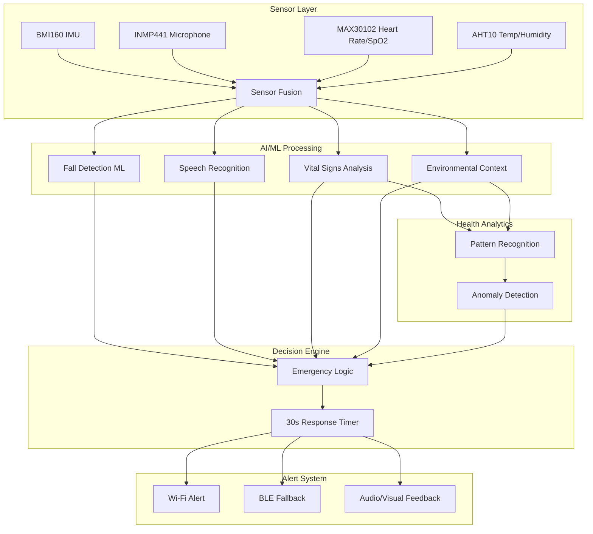

# 🛡️ Guardian Angel Enhanced (Embedded AI/ML Emergency System)

**Guardian Angel Enhanced** is a comprehensive, AI-enabled wearable system that demonstrates real-world embedded ML applications on platforms like ESP32 and STM32. The system provides multi-modal health monitoring with fall detection, emergency speech recognition, vital signs monitoring, and environmental sensing to create a complete safety solution for elderly or vulnerable individuals.

## 🎯 Enhanced Project Objectives

* 🚨 **Fall Detection** using IMU (BMI160) and ML model
* 🗣️ **Speech Recognition** for emergency keywords ("help", "I need help")
* ❤️ **Vital Signs Monitoring** using MAX30102 (heart rate, SpO2)
* 🌡️ **Environmental Monitoring** using AHT10 (temperature, humidity)
* ⏱️ **Fail-Safe Timer**: Multi-condition emergency detection with 30s response window
* 📡 **Smart Emergency Alert** via Wi-Fi with contextual health data
* 🧠 **AI-Powered Health Analytics** for pattern recognition and anomaly detection

## 🧩 Enhanced System Architecture



## 🔌 Hardware Wiring Diagram

```
ESP32-S3 Pin Configuration:
├── I2C Bus (SDA: GPIO21, SCL: GPIO22)
│   ├── BMI160 (0x68) - IMU Sensor
│   ├── MAX30102 (0x57) - Heart Rate/SpO2
│   └── AHT10 (0x38) - Temperature/Humidity
├── I2S Bus (BCLK: GPIO4, WS: GPIO5, DIN: GPIO6)
│   └── INMP441 - Microphone
├── GPIO Outputs
│   ├── GPIO2 - Status LED
│   ├── GPIO3 - Buzzer
│   └── GPIO8 - Emergency LED
└── Power (3.3V, GND)
```

## 🔧 Enhanced Hardware Components

| Component | Purpose | Interface | Power |
|-----------|---------|-----------|--------|
| ESP32-S3 | Main MCU + AI acceleration | - | 3.3V |
| BMI160 | Accelerometer + Gyroscope | I2C | 3.3V |
| INMP441 | Microphone (speech input) | I2S | 3.3V |
| MAX30102 | Heart rate + SpO2 monitoring | I2C | 3.3V |
| AHT10 | Temperature + Humidity | I2C | 3.3V |
| Buzzer/LED | Feedback/Alert indication | GPIO | 3.3V |
| Li-Po Battery | Power supply | - | 3.7V |

## 🧠 Enhanced AI/ML Components

### 1. Fall Detection
- **Input**: BMI160 accelerometer + gyroscope data
- **Model**: TFLite Micro neural network
- **Features**: Acceleration magnitude, angular velocity, orientation changes
- **Accuracy Target**: >95% with environmental context

### 2. Speech Recognition
- **Input**: INMP441 microphone audio
- **Framework**: ESP-SR or TFLite keyword spotting
- **Keywords**: "help", "emergency", "I need help", "call doctor"
- **Response Time**: <500ms

### 3. Vital Signs Analysis
- **Input**: MAX30102 PPG signals
- **Processing**: Real-time heart rate and SpO2 calculation
- **ML Features**: Heart rate variability, trend analysis
- **Anomaly Detection**: Sudden changes, critical thresholds

### 4. Environmental Context
- **Input**: AHT10 temperature and humidity
- **Processing**: Environmental comfort analysis
- **Integration**: Context for fall detection (e.g., heat stroke conditions)

## 📊 Enhanced Emergency Detection Logic

```python
def emergency_detection_logic():
    # Multi-modal emergency detection
    fall_detected = fall_ml_model.predict(imu_data) > 0.8
    vital_emergency = (heart_rate < 50 or heart_rate > 120 or spo2 < 90)
    environmental_risk = (temperature > 35 or temperature < 10 or humidity > 90)
    speech_emergency = keyword_detected in ["help", "emergency"]
    
    if fall_detected or vital_emergency or speech_emergency:
        start_emergency_timer()
        collect_context_data()
        
    if environmental_risk:
        increase_monitoring_frequency()
```

## 🚀 Enhanced Development Timeline (18 Days)

| Day(s) | Task | Deliverables |
|--------|------|-------------|
| 1-2 | Setup ESP32, test BMI160 and basic IMU | IMU data collection working |
| 3-4 | Integrate MAX30102, test heart rate/SpO2 | Vital signs monitoring |
| 5 | Integrate AHT10, test environmental sensing | Environmental data collection |
| 6-7 | Collect comprehensive dataset (fall + vitals + env) | Training dataset |
| 8-9 | Train enhanced fall detection model with context | ML model v1 |
| 10-11 | Setup INMP441, implement speech recognition | Speech detection working |
| 12-13 | Develop multi-modal emergency detection logic | Integrated detection system |
| 14-15 | Implement health analytics and anomaly detection | AI health monitoring |
| 16 | Port to STM32H562 with NPU optimization | STM32 version |
| 17 | System integration testing and optimization | Complete system testing |
| 18 | Documentation, demo video, and final polish | Project completion |

## 📂 Enhanced Project Structure

```
/firmware/
    ├── esp32/
    │   ├── main/
    │   │   ├── imu_fall_detect.c
    │   │   ├── speech_keyword_detect.c
    │   │   ├── vital_signs_monitor.c
    │   │   ├── environmental_sensor.c
    │   │   └── emergency_logic.c
    │   ├── components/
    │   │   ├── bmi160_driver/
    │   │   ├── max30102_driver/
    │   │   ├── aht10_driver/
    │   │   └── ml_inference/
    │   └── tests/
    ├── stm32/
    │   ├── npu_fall_detect/
    │   ├── audio_inference/
    │   └── sensor_fusion/
/ml_models/
    ├── tflite_fall_model/
    │   ├── fall_detection_v2.tflite
    │   └── model_quantized.tflite
    ├── wake_word_model/
    └── vital_signs_model/
/data/
    ├── imu_raw_data.csv
    ├── vital_signs_data.csv
    ├── environmental_data.csv
    └── emergency_scenarios.csv
/tools/
    ├── data_collection/
    ├── model_training/
    └── system_testing/
/docs/
    ├── system_diagram.md
    ├── hardware_setup.md
    ├── api_reference.md
    └── user_manual.md
```

## 🔌 I2C Configuration

```c
// I2C pin configuration for ESP32-S3
#define I2C_SDA_PIN 21
#define I2C_SCL_PIN 22
#define I2C_FREQ_HZ 400000

// I2C device addresses
#define BMI160_I2C_ADDR     0x68
#define MAX30102_I2C_ADDR   0x57
#define AHT10_I2C_ADDR      0x38
```

## 📈 Enhanced Success Criteria

### Performance Metrics
- **Fall Detection**: >95% accuracy with <2% false positives
- **Speech Recognition**: <500ms response time, >90% accuracy
- **Vital Signs**: ±2 BPM heart rate accuracy, ±2% SpO2 accuracy
- **Environmental**: ±0.3°C temperature, ±2% humidity accuracy
- **System Latency**: Emergency detection to alert <2s
- **Power Consumption**: <50mA average, >24h battery life

### Integration Metrics
- **Multi-sensor Fusion**: Seamless data integration from all sensors
- **Context Awareness**: Environmental factors improve fall detection
- **Health Analytics**: Trend analysis and anomaly detection working
- **STM32 NPU**: Successful port with maintained performance

## 📽️ Enhanced Demo Scenarios

### Scenario 1: Normal Monitoring
- Continuous monitoring of all sensors
- Real-time health dashboard
- Environmental comfort tracking
- Background AI analysis

### Scenario 2: Fall with Vital Signs Context
- Fall detected with elevated heart rate
- Environmental factors considered (hot day)
- 30s countdown with vital signs display
- Comprehensive emergency alert with context

### Scenario 3: Vital Signs Emergency
- Heart rate drops below 50 BPM
- No fall detected but medical emergency
- Immediate alert with vital signs data
- Environmental context included

### Scenario 4: Speech Emergency
- User says "help" or "emergency"
- Immediate alert with current health status
- All sensor data included in emergency packet
- No countdown timer

### Scenario 5: Environmental Risk
- High temperature detected (>35°C)
- Increased monitoring frequency
- Predictive alerts for heat-related issues
- Preventive health recommendations

## 🌐 Enhanced Alert System

### Emergency Data Packet
```json
{
  "timestamp": "2025-07-16T10:30:00Z",
  "emergency_type": "fall_detected",
  "confidence": 0.94,
  "vital_signs": {
    "heart_rate": 85,
    "spo2": 97,
    "trend": "stable"
  },
  "environmental": {
    "temperature": 22.5,
    "humidity": 45,
    "comfort_index": "normal"
  },
  "location": "home",
  "user_id": "user_001",
  "device_id": "guardian_angel_001"
}
```

## 🔋 Power Management

### Power Optimization Strategies
- **Sensor Duty Cycling**: Reduce sampling rates during normal activity
- **AI Model Optimization**: Quantized models for lower power consumption
- **Sleep Modes**: Deep sleep between measurements
- **Adaptive Monitoring**: Increase frequency only when needed

### Estimated Power Consumption
- **Active Monitoring**: 45mA
- **Emergency Mode**: 80mA
- **Sleep Mode**: 10mA
- **Average**: 35mA (>30h battery life with 1200mAh battery)

## 🧪 Testing and Validation

### Unit Tests
- Individual sensor functionality
- ML model accuracy validation
- Communication protocol testing
- Power consumption measurement

### Integration Tests
- Multi-sensor data fusion
- Emergency detection scenarios
- Alert system reliability
- User interface responsiveness

### Field Tests
- Real-world fall scenarios
- Long-term monitoring accuracy
- Environmental condition testing
- Battery life validation

## 👨‍💻 Author
**Mohtashim Sadiq** — Embedded Systems Engineer specializing in AI/ML on edge devices and health monitoring systems.

## 📜 License
This project is open source and available under the MIT License.

## 🤝 Contributing
Contributions are welcome! Please see CONTRIBUTING.md for guidelines on:
- Adding new sensor support
- Improving ML models
- Enhancing emergency detection logic
- Power optimization techniques

---

*Guardian Angel Enhanced: Protecting lives through intelligent edge AI and comprehensive health monitoring.*
