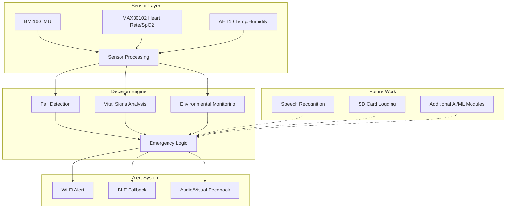

# 🛡️ Guardian Angel Enhanced (Embedded Health Monitoring System)

`Guardian Angel Enhanced` is a wearable embedded monitoring project focused on three active sensing functions:
- **Fall detection** using **BMI160**
- **Heart rate and SpO2 monitoring** using **MAX30102**
- **Temperature and humidity monitoring** using **AHT10**

Other features from the original concept, including microphone-based speech detection, SD card data logging/saving, and additional intelligence layers, are **not implemented yet** and will be added in future development phases.

## 🎯 Current Project Objectives

- 🚨 **Fall Detection** using BMI160 IMU data
- ❤️ **Vital Signs Monitoring** using MAX30102 (heart rate and SpO2)
- 🌡️ **Environmental Monitoring** using AHT10 (temperature and humidity)
- 📡 **Emergency Alert Logic** based on sensor thresholds and fall events
- 🧠 **Future ML Expansion** for model-based detection and analytics

## 🧩 Current System Architecture


```mermaid
graph TB
    subgraph "Sensor Layer"
        A[BMI160 IMU] --> D[Sensor Processing]
        C[MAX30102 Heart Rate/SpO2] --> D
        E[AHT10 Temp/Humidity] --> D
    end

    subgraph "Decision Engine"
        D --> F[Fall Detection]
        D --> G[Vital Signs Analysis]
        D --> H[Environmental Monitoring]
        F --> I[Emergency Logic]
        G --> I
        H --> I
    end

    subgraph "Alert System"
        I --> J[Wi-Fi Alert]
        I --> K[BLE Fallback]
        I --> L[Audio/Visual Feedback]
    end

    subgraph "Future Work"
        M[Speech Recognition] -.-> I
        N[SD Card Logging] -.-> I
        O[Additional AI/ML Modules] -.-> I
    end
```

## 🔌 Hardware Wiring Diagram

```text
ESP32-S3 Pin Configuration:
├── I2C Bus (SDA: GPIO21, SCL: GPIO22)
│   ├── BMI160 (0x68) - IMU Sensor
│   ├── MAX30102 (0x57) - Heart Rate/SpO2
│   └── AHT10 (0x38) - Temperature/Humidity
├── GPIO Outputs
│   ├── GPIO2 - Status LED
│   ├── GPIO3 - Buzzer
│   └── GPIO8 - Emergency LED
└── Power (3.3V, GND)
```

## 🔧 Hardware Components

| Component | Purpose | Interface | Power |
|-----------|---------|-----------|--------|
| ESP32-S3 | Main MCU | - | 3.3V |
| BMI160 | Accelerometer + Gyroscope | I2C | 3.3V |
| MAX30102 | Heart rate + SpO2 monitoring | I2C | 3.3V |
| AHT10 | Temperature + Humidity | I2C | 3.3V |
| Buzzer/LED | Feedback / alert indication | GPIO | 3.3V |
| Li-Po Battery | Power supply | - | 3.7V |

## 🧠 Current Functional Blocks

### 1. Fall Detection
- **Input**: BMI160 accelerometer + gyroscope data
- **Processing**: Threshold-based detection or lightweight ML model
- **Output**: Fall event flag for emergency handling

### 2. Vital Signs Monitoring
- **Input**: MAX30102 PPG signals
- **Processing**: Heart rate and SpO2 calculation
- **Output**: Live health readings and abnormal-condition flags

### 3. Environmental Monitoring
- **Input**: AHT10 temperature and humidity
- **Processing**: Comfort and risk evaluation
- **Output**: Ambient condition status

## 📊 Emergency Detection Logic

```python
def emergency_detection_logic():
    fall_detected = detect_fall(bmi160_data)
    vital_emergency = (heart_rate < 50 or heart_rate > 120 or spo2 < 90)
    environmental_risk = (temperature > 35 or temperature < 10 or humidity > 90)

    if fall_detected or vital_emergency:
        trigger_emergency_alert()
        send_live_sensor_context()

    if environmental_risk:
        increase_monitoring_frequency()

# Note:
# Speech recognition, SD card logging, and other advanced
# features are planned for later and still need to be implemented.
```

## 🚀 Development Timeline

| Phase | Task | Deliverables |
|------|------|-------------|
| 1 | Set up ESP32 and test BMI160 | IMU data collection working |
| 2 | Integrate MAX30102 | Heart rate and SpO2 monitoring |
| 3 | Integrate AHT10 | Temperature and humidity data |
| 4 | Implement emergency logic | Fall and vital-sign alerts |
| 5 | Add remaining features later | Speech, SD card logging, and other modules |

## 📂 Project Structure

```text
/firmware/
    └── esp32/
        ├── main/
        │   ├── imu_fall_detect.c
        │   ├── vital_signs_monitor.c
        │   ├── environmental_sensor.c
        │   └── emergency_logic.c
        ├── components/
        │   ├── bmi160_driver/
        │   ├── max30102_driver/
        │   ├── aht10_driver/
        │   └── sensor_processing/
        └── tests/
/docs/
    ├── system_diagram.md
    ├── hardware_setup.md
    ├── api_reference.md
    └── user_manual.md
```

## 🔌 I2C Configuration

```c
// I2C pin configuration for ESP32-S3
#define I2C_SDA_PIN 21
#define I2C_SCL_PIN 22
#define I2C_FREQ_HZ 400000

// I2C device addresses
#define BMI160_I2C_ADDR     0x68
#define MAX30102_I2C_ADDR   0x57
#define AHT10_I2C_ADDR      0x38
```

## 📈 Success Criteria

- **Fall Detection**: Reliable BMI160-based detection
- **Heart Rate**: Stable MAX30102 readings
- **SpO2**: Accurate oxygen saturation estimation
- **Environmental**: Stable AHT10 sensing
- **System Latency**: Fast emergency response
- **Future Work**: Remaining features still need to be implemented

## 🧪 Testing and Validation

### Unit Tests
- BMI160 sensor functionality
- MAX30102 heart rate and SpO2 measurement
- AHT10 temperature and humidity measurement
- Emergency alert trigger logic

### Integration Tests
- Multi-sensor data handling
- Fall detection scenarios
- Vital signs threshold checks
- Alert system reliability

## 👨‍💻 Author
**Mohtashim Sadiq** — Embedded Systems Engineer specializing in AI/ML on edge devices and health monitoring systems.

## 📜 License
This project is open source and available under the MIT License.

## 🤝 Contributing
Contributions are welcome! Please see CONTRIBUTING.md for guidelines on:
- Adding new sensor support
- Improving detection logic
- Implementing the remaining planned features
- Power optimization techniques

---

*Guardian Angel Enhanced: Current scope covers BMI160, MAX30102, and AHT10. Speech recognition, SD card saving, and other advanced modules still need to be implemented.*
