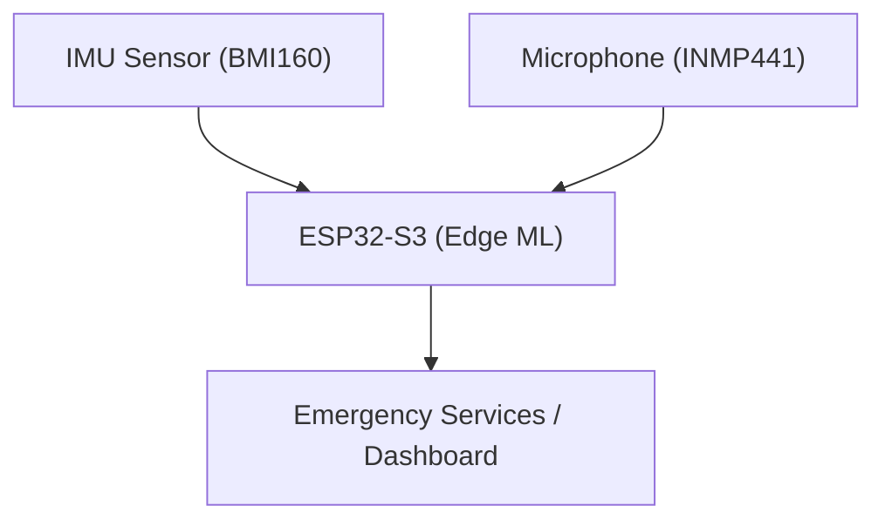

# 🛡️ Guardian Angel (Embedded AI/ML Emergency System)

**Guardian Angel** is a lightweight, AI-enabled wearable system that demonstrates real-world embedded ML applications on platforms like ESP32 and STM32. The system detects falls and recognizes emergency speech commands like "help" to trigger alerts, simulating a life-saving wearable for elderly or vulnerable individuals.

---

## 🎯 Project Objectives

- 🚨 **Fall Detection** using an IMU (BMI160) and ML model.
- 🗣️ **Speech Recognition** for keywords like "help", "I need help".
- ⏱️ **Fail-Safe Timer**: If a fall is detected and no response is heard in 30s, trigger alert.
- 📡 **Emergency Alert** via Wi-Fi (or BLE/Serial fallback).

---

## 🧩 System Architecture

<details>
<summary>Click to expand Mermaid Graph (compatible)</summary>


</details>

---

## 🧠 AI/ML Components

### Fall Detection
- Accelerometer + Gyroscope data used for classification.
- Trained using TFLite / TFLite Micro.
- Option for threshold-based fallback.

### Speech Recognition
- Wake word detection ("help", "emergency") using:
  - `ESP-SR` framework (ESP32-S3)
  - TFLite keyword spotting models

---

## 🔧 Hardware Used

| Component     | Purpose                         |
|--------------|----------------------------------|
| ESP32-S3     | Main MCU + AI acceleration       |
| BMI160       | Accelerometer + Gyroscope        |
| INMP441      | Microphone (for speech input)    |
| Buzzer / LED | Feedback / Alert indication      |

---

## 🚀 Development Timeline (15 Days)

| Day(s) | Task |
|--------|------|
| 1–2 | Setup ESP32, test BMI160 |
| 3–4 | Collect fall dataset, preprocess data |
| 5–6 | Train fall detection model, deploy to ESP32 |
| 7–8 | Setup INMP441, test microphone input |
| 9–10 | Integrate keyword recognition (ESP-SR / TFLite) |
| 11–12 | Combine fall + speech detection + timer logic |
| 13–14 | Port to STM32H562 (test NPU performance) |
| 15 | Final testing and documentation/demo video |

---

## 📂 Project Structure

```
/firmware/
    ├── esp32/
    │   ├── imu_fall_detect/
    │   └── speech_keyword_detect/
    ├── stm32/
    │   ├── npu_fall_detect/
    │   └── audio_inference/
/ml_models/
    ├── tflite_fall_model/
    └── wake_word_model/
/data/
    └── imu_raw_data.csv
/docs/
    └── system_diagram.md
```

---

## ✅ Success Criteria

- [ ] Fall detection accuracy > 90%
- [ ] Wake word detection response < 500ms
- [ ] Full system latency (fall to alert) < 2s
- [ ] Portability to STM32 platform with NPU support

---

## 📽️ Demo Scenarios

- **Normal Monitoring**: Continuous IMU + microphone listening.
- **Fall Detected**: 30s countdown for speech input. No response → alert sent.
- **User Says "Help"**: Immediate emergency alert sent.
- **STM32 Version**: ML inference on STM32H562 to showcase edge processing.

---

## 👨‍💻 Author

Mohtashim Sadiq — Embedded Systems Engineer with a focus on AI/ML on edge devices.

---

## 📜 License

This project is open source and available under the [MIT License](LICENSE).

---
